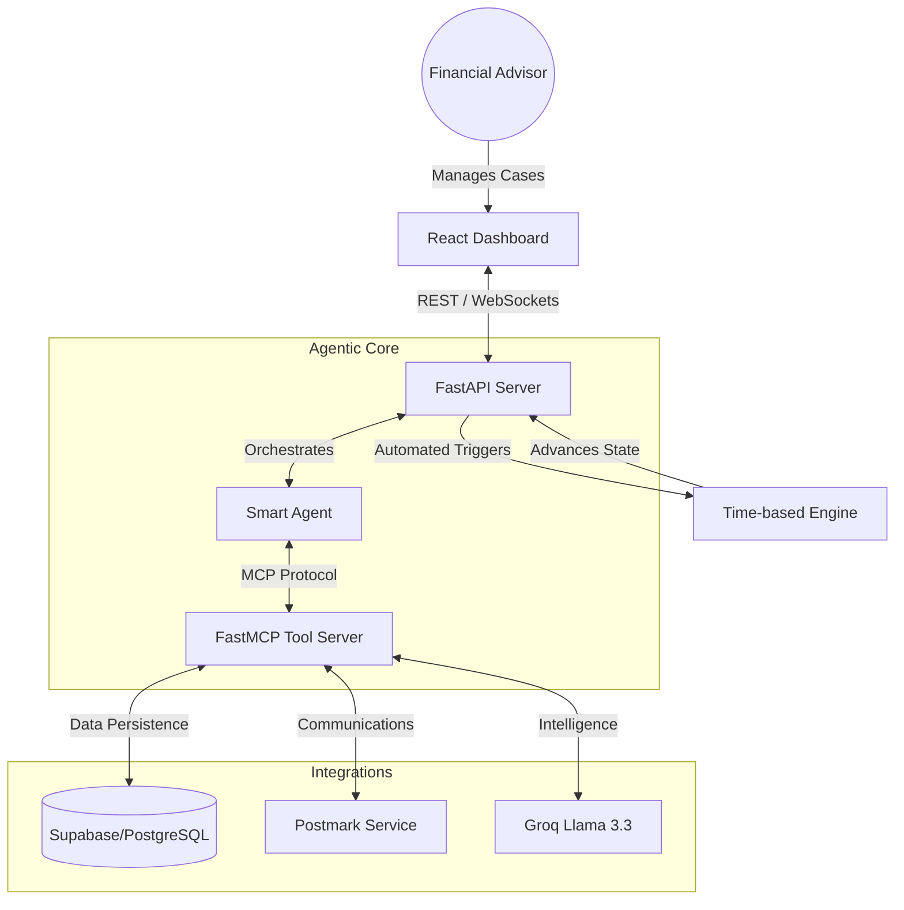

# AdvisoryAI - Financial Advisory Intelligence Chassis

[](https://opensource.org/licenses/MIT)
[](https://fastapi.tiangolo.com/)
[](https://reactjs.org/)
[](https://modelcontextprotocol.io/)

**AdvisoryAI** is a production-grade, autonomous financial advisory system designed to eliminate the "chasing" burden for financial advisors. By leveraging a state-driven agent and the Model Context Protocol (MCP), it proactively manages client requests, automates documentation workflows, and ensures compliance through deterministic tracking.

## 🌟 Why AdvisoryAI?

Financial advisors spend up to 40% of their time chasing clients and providers for information. AdvisoryAI converts "unmanaged silence" into actionable progress.

- **Silence as a Signal**: Automatically detects when a request has stalled and triggers appropriate follow-up actions.
- **Advisor-First Design**: Designed to protect the advisor's time, escalating only when human judgment is strictly required.
- **Audit-Ready by Default**: Every action, email, and state change is logged with a clear rationale.
- **Secure & Compliant**: Built with PII protection and secure, scoped upload windows.

## 🏗 System Architecture

AdvisoryAI utilizes a modern, decoupled architecture centered around the Model Context Protocol (MCP).



## 📂 Project Structure

- **[`client/`](file:///Users/aryannagpal/Documents/advisoryAI/client)**: Premium React frontend with a monochromatic "Stealth Grey" design system.
- **[`server/`](file:///Users/aryannagpal/Documents/advisoryAI/server)**: FastAPI backend orchestrating cases, requests, and the agentic lifecycle.
- **[`server/agent_mcp/`](file:///Users/aryannagpal/Documents/advisoryAI/server/agent_mcp)**: The Tooling Layer. High-fidelity tools exposed via FastMCP.
- **[`docs/`](file:///Users/aryannagpal/Documents/advisoryAI/docs)**: Comprehensive [PRD](file:///Users/aryannagpal/Documents/advisoryAI/docs/PRD.md) and [TRD](file:///Users/aryannagpal/Documents/advisoryAI/docs/TRD.md).

## ⚡️ Quick Start

### 1. Prerequisites
- Docker & Docker Compose
- Supabase Account (PostgreSQL)
- Groq API Key
- Postmark Server Token (for Email)

### 2. Environment Setup
```bash
# Server configuration
cp server/.env.example server/.env
# Edit server/.env with your keys

# Client configuration
cp client/.env.example client/.env
```

### 3. Launch
```bash
docker-compose up --build
```
Access the dashboard at `http://localhost:80`.

## 🛡 Security & Compliance

- **Minimal PII Storage**: We prioritize metadata over content. No financial values or sensitive document contents are stored in plain text logs.
- **Secure Uploads**: Magic links for document submission are time-bound and scoped to specific requests.
- **Deterministic Action**: The agent follows predefined policy rules; it does not "hallucinate" business decisions.

## 📖 Further Reading

- [Product Requirements (PRD)](file:///Users/aryannagpal/Documents/advisoryAI/docs/PRD.md)
- [Technical Design (TRD)](file:///Users/aryannagpal/Documents/advisoryAI/docs/TRD.md)

