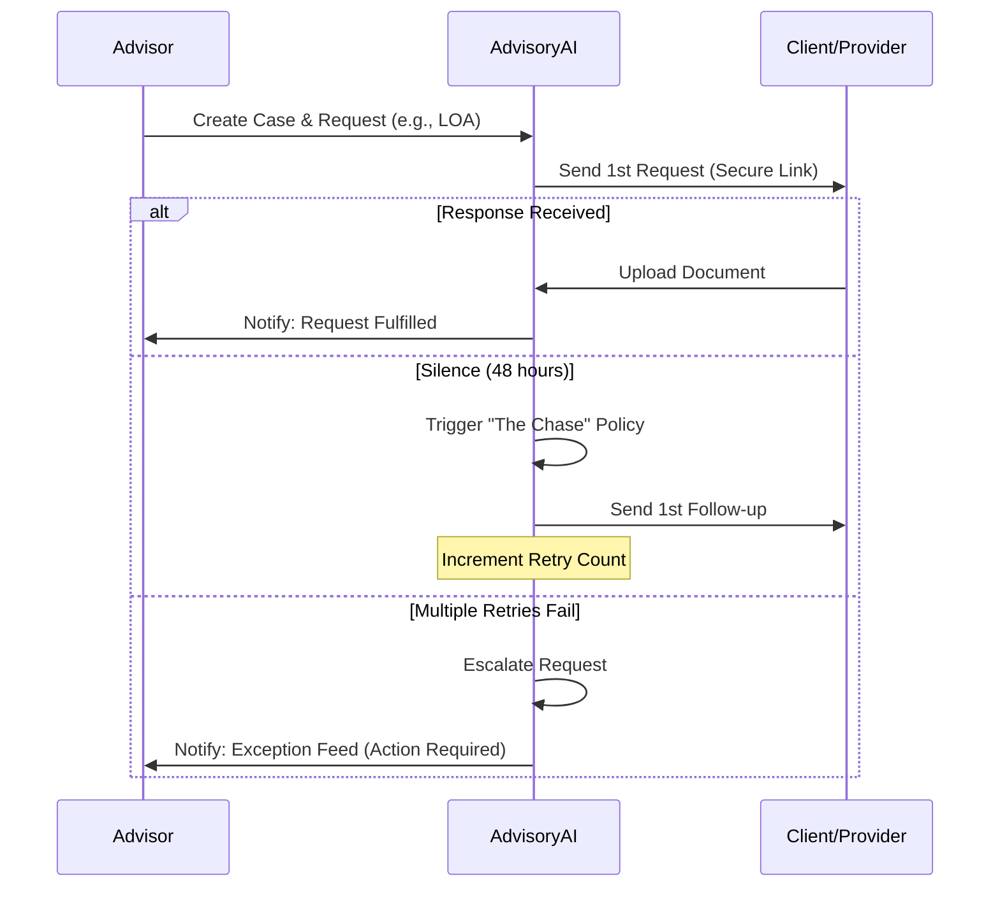

# AdvisoryAI: Product Requirements Document (PRD)

## 1. Executive Summary

### 1.1 Problem Statement
The "last mile" of financial advice is plagued by manual follow-ups. Independent Financial Advisors (IFAs) spend significant overhead chasing clients for identification, and providers (like Aviva or L&G) for Letters of Authority (LOA). 
- **The Gap**: Silence is often misinterpreted as "work in progress," leading to multi-week delays.
- **The Result**: Reduced advisor capacity, increased compliance risk, and poor client experience.

### 1.2 Product Vision
To create a "self-healing" case management system where the default state is progress. AdvisoryAI owns the follow-up lifecycle, treating silence as a trigger for action rather than a dead-end.

### 1.3 Success Metrics (KPIs)
- **Time to Fulfillment**: Reduce average request completion time by 30%.
- **Advisor Touchpoints**: Decrease the number of manual follow-ups initiated by advisors by 80%.
- **Silence Detection**: 100% of stalled requests identified and acted upon within 24 hours of a policy breach.

---

## 2. Target Audience & User Journey

### 2.1 Primary User
**The Independent Financial Advisor (IFA)**: Overwhelmed by administrative tasks, focused on high-value client strategy but bogged down by "the chase."

### 2.2 User Journey Flow

---

## 3. Product Features & Scope

### 3.1 Core Features
- **Deterministic State Machine**: Requests move through a rigid lifecycle (`PENDING` → `WAITING` → `FULFILLED` or `ESCALATED`).
- **Policy-Driven Automation**: Automated triggers based on elapsed time and retry counts.
- **Magic Link Uploads**: One-click, secure document submission for clients, bypassing login friction.
- **Exception Feed**: A curated "heat map" of requests that require manual intervention.
- **Audit Logging**: Immutable trail describing *why* the system took a specific action.

### 3.2 Out of Scope
- Automated legal document signing.
- Complex multi-agent negotiation.
- Direct financial advice generation.

---

## 4. Design Principles

- **Silence is a Signal**: If we haven't heard back, something is wrong. Act accordingly.
- **Advisor Time is Sacred**: Never interrupt the advisor if the system can resolve the stall.
- **Total Transparency**: The system must always be able to answer "Where is this request?" and "Why did you send that email?".
- **Conservative Validation**: Better to escalate a "maybe" document than to accept an invalid one.

---

## 5. Security & Privacy

- **Data Minimization**: Store the least amount of PII possible.
- **Scoped Access**: Document upload tokens are single-purpose and time-bound.
- **Auditability**: Every system decision is logged for compliance review.
