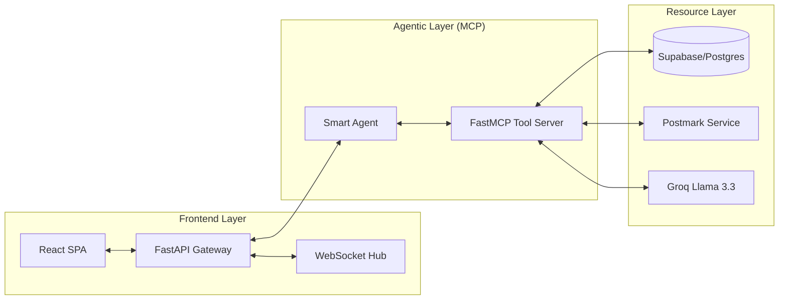
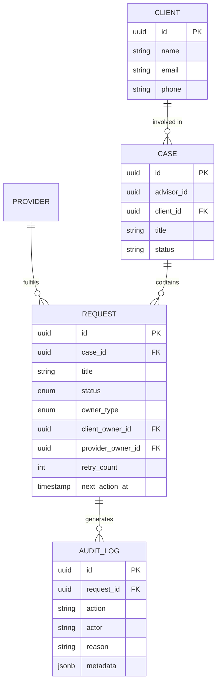
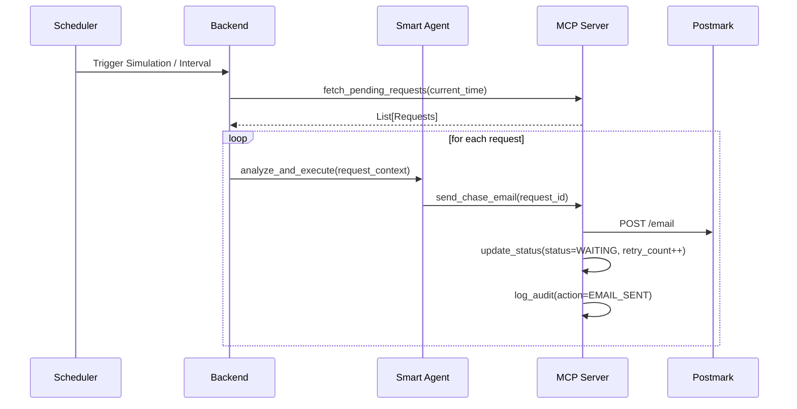

# AdvisoryAI: Technical Requirements Document (TRD)

## 1. System Architecture

AdvisoryAI follows an asynchronous, event-driven pattern where a stateless FastAPI frontend orchestrates a stateful background lifecycle via the Model Context Protocol (MCP).

### 1.1 High-Level Logical Diagram

---

## 2. Data Model & Schema

The system uses a normalized PostgreSQL schema (managed via Supabase) to track the lifecycle of cases and requests.

### 2.1 Entity Relationship Diagram (ERD)

---

## 3. The "Automated Chase" Lifecycle

### 3.1 Lifecycle Sequence

---

## 4. API & Integration Design

### 4.1 MCP Tools (FastMCP)
The MCP server exposes a standard interface for the agent to interact with the world:
- `get_overdue_requests`: Queries DB for items past their `next_action_at`.
- `send_followup`: Orchestrates email creation and status updates.
- `validate_document`: Basic heuristic check for uploaded files.

### 4.2 Security & Transports
- **Auth**: JWT-based authentication for the FastAPI gateway.
- **Transports**: Standard SSE (Server-Sent Events) or HTTP for MCP communication.
- **Uploads**: Requests generate a signed `upload_token` used as a magic link for clients.

---

## 5. Deployment & Observability

- **Containerization**: Multi-stage Docker builds for Python (Backend) and Node.js (Frontend).
- **Logging**: Level-based structured logging (filtering out PII).
- **Monitoring**: Health check endpoints at `/api/health`.
